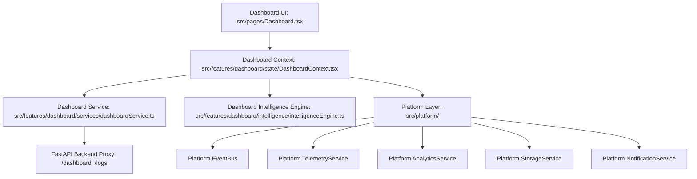

# FitNova AI — Dashboard Platform Architecture (Sprint 2.5)

## Overview

The **Dashboard OS** serves as the central command cockpit of FitNova AI. Under Sprint 2.5, the dashboard architecture was refactored into a high-reliability, reactive system backed by the **Platform Foundation Layer** (`src/platform/`) and the **Dashboard Intelligence Engine** (`src/features/dashboard/`).

---

## 1. End-to-End Architectural Flow

The data and control flow follows a strict layered pattern:

### Layer Responsibilities:
1. **Dashboard UI (`src/pages/Dashboard.tsx`)**:
   - Renders visual layout: Hero greeting, Nova Intelligence Score dial, Quick Action buttons, Daily Progress cards, and Activity charts.
   - Emits user analytics (`DASHBOARD_VIEWED`, `QUICK_ACTION_CLICKED`, `WATER_LOGGED`).
   - Handles skeleton states during initial load and displays graceful error recovery without blank-screen crashes.
2. **Dashboard Context (`src/features/dashboard/state/DashboardContext.tsx`)**:
   - Holds centralized reactive dashboard state (metrics, streaks, recent activity, intelligence score).
   - Subscribes to platform `EventBus` (`WATER_LOGGED`, `MEAL_LOGGED`, `WORKOUT_COMPLETED`).
   - Automatically recalculates dynamic scores and re-fetches underlying data upon event signals.
3. **Dashboard Intelligence Engine (`src/features/dashboard/intelligence/intelligenceEngine.ts`)**:
   - Calculates the holistic **Nova Readiness & Compliance Score** (0–100) based on workout completion, calorie target adherence, and hydration goals.
   - Generates contextual insights (e.g. "Hydration target achieved", "High protein compliance today").
4. **Platform Foundation (`src/platform/`)**:
   - Provides decoupled pub/sub events, telemetry latency tracking, crash-resilient storage, and non-blocking notifications.

---

## 2. Reactive EventBus Recalculation Flow

The Dashboard does not poll for external state changes. Instead, it listens to the platform `EventBus`:

| Trigger Event | Source Module | Dashboard Reaction |
|---|---|---|
| `WATER_LOGGED` | Nutrition Page or Quick Action | Recalculates hydration progress, emits notification toast, updates Intelligence Score. |
| `MEAL_LOGGED` | Nutrition OS or Food Scanner | Updates calorie and macro daily bars, adjusts nutrition compliance index. |
| `WORKOUT_COMPLETED` | Workout Tracker | Increments streak counter, logs volume/set achievements, updates readiness score. |
| `PROFILE_UPDATED` | Settings Page | Adjusts BMR and daily caloric/macro targets dynamically. |

---

## 3. Resilience, Skeletons, and Graceful Degradation

### 1. Skeleton Loading States
During data fetching, the UI renders pulsing skeleton cards that match the exact layout geometry of the dashboard cards, preventing layout shifts (CLS) and visual jank.

### 2. Error Boundary & Fallback Handling
If an API request fails:
- The dashboard catches the error and normalizes it to a `FitNovaError`.
- Non-critical components degrade to safe local defaults (or cached values from `StorageService`).
- A retry button allows users to re-trigger synchronization without refreshing the entire page.

### 3. Latency Telemetry & Observability
- All dashboard API requests track timing through `TelemetryService.recordLatency('API_LATENCY', ...)`.
- Outlier queries exceeding 2,000ms are flagged for investigation.
- User interactions are tracked in `AnalyticsService` for product behavior insights.

---

## 4. Zero Coupling Guarantee

The Dashboard has **zero direct imports** from:
- `src/pages/Nutrition.tsx`
- `src/pages/Workouts.tsx`
- `src/pages/MealPlanner.tsx`
- `src/pages/FoodScanner.tsx`

All cross-module synchronization is facilitated exclusively through typed events on `EventBus`. Adding or refactoring other features never requires modifications to dashboard internals.
