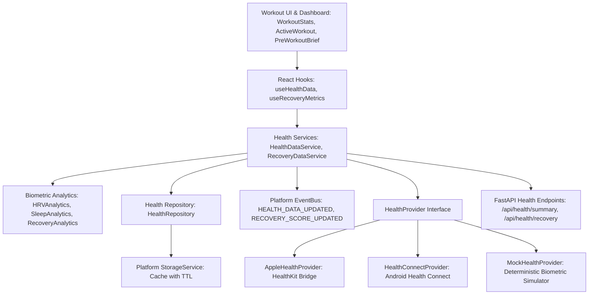

# FitNova AI — Health Platform & Wearable Integration Architecture (Sprint 3.7)

## Overview

The **FitNova AI Health Platform** (`src/features/health/`) delivers a decoupled, provider-abstracted health and wearable data integration layer. It allows FitNova AI to ingest, normalize, analyze, and persist biometric telemetry (Heart Rate, Heart Rate Variability, Sleep Architecture, and Daily Activity) from Apple HealthKit, Android Health Connect, and development simulators without coupling UI or domain logic to native device SDKs.

---

## 1. Architectural Hierarchy & Dependency Rule

The Health feature strictly respects FitNova AI's unidirectional architectural hierarchy:



### Key Principles:
- **Zero UI Coupling in Pure Domain/Service Logic**: Models, analytics math, normalization, and provider bridges contain **zero React or JSX dependencies**.
- **Provider Abstraction**: UI components and workout intelligence engines depend only on `HealthDataService` and normalized domain models, never on vendor-specific SDKs.
- **Graceful Fallback**: If running in a web browser without native HealthKit or Health Connect bridges, the system seamlessly falls back to the deterministic `MockHealthProvider` without crashing or blocking user workflows.
- **Strict Typing (Zero `any`)**: All models, events, analytics outputs, and API schemas are strongly typed in TypeScript and Pydantic.

---

## 2. Directory Structure

```
src/features/health/
├── models/                     # Strongly typed biometric domain entities
│   ├── HeartRateSample.ts      # Instantaneous & resting heart rate telemetry
│   ├── HRVSample.ts            # Autonomic rMSSD biometrics & status
│   ├── SleepStage.ts           # Deep, REM, Light, Awake stage intervals
│   ├── SleepSession.ts         # Total duration, efficiency %, sleep score
│   ├── DailyActivity.ts        # Steps, active calories, distance, active minutes
│   ├── RecoveryMetrics.ts      # Composite recovery score (0-100), readiness state
│   └── index.ts
├── types/                      # Provider capabilities, sync statuses, queries
│   ├── healthEnums.ts          # HealthProviderType, HealthSyncStatus, ReadinessState
│   ├── healthContracts.ts      # HealthDateRangeQuery, HealthSummaryContract
│   └── index.ts
├── providers/                  # External wearable provider implementations
│   ├── HealthProvider.ts       # Abstract interface defining standard provider contract
│   ├── MockHealthProvider.ts   # Deterministic biometric simulator for dev/testing
│   ├── AppleHealthProvider.ts  # iOS HealthKit bridge (Capacitor/Cordova)
│   ├── HealthConnectProvider.ts# Android Health Connect bridge
│   └── index.ts
├── repositories/               # Caching & persistent storage
│   ├── IHealthRepository.ts    # Interface definition
│   ├── HealthRepository.ts     # Bounded TTL cache via Platform StorageService
│   └── index.ts
├── analytics/                  # Biometric math & statistical algorithms
│   ├── HRVAnalytics.ts         # rMSSD baseline deviation, coefficient of variation
│   ├── SleepAnalytics.ts       # Sleep score, sleep architecture ratios
│   ├── RecoveryAnalytics.ts    # Multi-factor composite recovery score calculation
│   └── index.ts
├── services/                   # Application services
│   ├── HealthDataService.ts    # Normalization pipeline, deduplication, sync
│   ├── RecoveryDataService.ts  # Daily recovery score coordinator
│   └── index.ts
├── hooks/                      # Presentation layer hooks
│   ├── useHealthData.ts        # Live wearable status, HR, HRV, sleep metrics
│   ├── useRecoveryMetrics.ts   # Today's recovery score, readiness state
│   └── index.ts
└── index.ts                    # Public feature exports
```

---

## 3. Provider Abstraction & Bridge Specifications

### `HealthProvider` Interface
Every external provider implements the standard lifecycle contract:
- `initialize(): Promise<boolean>`
- `isAvailable(): Promise<boolean>`
- `requestPermissions(): Promise<boolean>`
- `getHeartRateSamples(query): Promise<HeartRateSample[]>`
- `getHRVSamples(query): Promise<HRVSample[]>`
- `getSleepSessions(query): Promise<SleepSession[]>`
- `getDailyActivity(date): Promise<DailyActivity | null>`
- `getSyncStatus(): Promise<HealthProviderSyncStatus>`

### Apple HealthKit Integration (`AppleHealthProvider`)
- Connects through native hybrid bridges (e.g. `@capacitor-community/health` or `cordova-plugin-health`).
- Queries `HKQuantityTypeIdentifierHeartRate`, `HKQuantityTypeIdentifierHeartRateVariabilitySDNN`, and `HKCategoryTypeIdentifierSleepAnalysis`.
- Automatically checks `isAvailable()` on startup; if window or native plugin is absent, marks available as `false`.

### Android Health Connect Integration (`HealthConnectProvider`)
- Queries Google Health Connect Client permissions (`androidx.health.connect.client`).
- Ingests `HeartRateRecord`, `HeartRateVariabilityRmssdRecord`, and `SleepSessionRecord`.
- Gracefully handles missing Play Services or ungranted permissions.

### Deterministic Simulator (`MockHealthProvider`)
- Emits realistic, physiologically plausible biometric curves for local development and CI testing.
- Allows testing acute stress, low sleep, and optimal recovery states deterministically.

---

## 4. Normalization Pipeline & Data Hygiene

Sensor data from wearables often contains noise, missed readings, or non-physiological artifacts. `HealthDataService` runs all incoming data through a strict normalization pipeline:

1. **Timestamp Normalization & Deduplication**:
   - Dates are normalized to ISO-8601 UTC timestamps.
   - Repeated sensor samples within the same 5-second window are deduplicated.
2. **Physiological Clamping**:
   - **Heart Rate**: Clamped to the physiological human range: `[30, 240]` BPM. Outliers outside this window are flagged or clipped.
   - **Heart Rate Variability (rMSSD)**: Clamped to `[5, 300]` ms. Negative or corrupted readings are discarded.
   - **Sleep Efficiency**: Calculated as `(timeAsleepMinutes / durationMinutes) * 100` and clamped to `[0, 100]%`.
3. **Repository Caching**:
   - Normalized metrics are cached in `HealthRepository` with a configurable Time-To-Live (default: 15 minutes) using `StorageService`.
   - Prevents redundant native bridge calls and preserves offline capability.

---

## 5. EventBus Integration

When health data synchronizes or recovery metrics update, `HealthDataService` broadcasts strongly-typed events on the platform `EventBus`:

| Event Name | Payload | Trigger | Subscribers |
|---|---|---|---|
| `HEALTH_DATA_UPDATED` | `{ providerId, timestamp, summary }` | On successful sync from wearable | Dashboard, WorkoutStats |
| `RECOVERY_SCORE_UPDATED` | `{ score, readinessState, hrvStatus, recommendedIntensity, timestamp }` | On daily recovery score re-evaluation | ActiveWorkout, PreWorkoutBrief, DashboardContext |

---

## 6. Non-Medical Fitness Guidance Disclaimer

> [!IMPORTANT]
> FitNova AI's wearable integration and recovery scores are strictly for general wellness, fitness conditioning, and athletic training optimization. FitNova AI does not provide medical diagnoses, treatment advice, or clinical monitoring.
