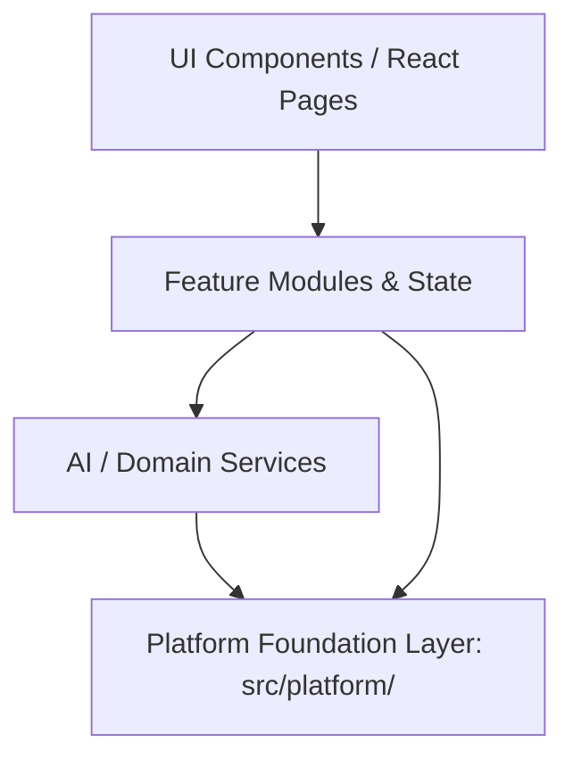

# FitNova AI — Platform Foundation Layer (Sprint 2.4)

## Overview

The **Platform Foundation Layer** (`src/platform/`) provides a reusable, decoupled, production-grade infrastructure layer for the entire FitNova AI application. It acts as the shared backbone supporting all feature modules (Dashboard OS, Workout OS, Nutrition OS, Meal Planner AI, Food AI Scanner, Recovery OS, Analytics OS, Nova AI, Wearable Integrations, Social features, and future extensions).

---

## 1. Architectural Principles & Dependency Direction

The FitNova AI architecture strictly adheres to a unidirectional dependency rule:



### Strict Non-Negotiable Rules:
- **UI → Feature → AI/Domain → Platform**: Lower layers know nothing about higher layers.
- **NEVER** `Platform → UI` or `Platform → Feature`: The platform layer has zero imports of React components, page views, or domain business logic.
- **Dependency Injection**: Services are instantiated and resolved via controlled containers (`PlatformContainer`), eliminating hidden global mutable state.
- **Fail-Safe & SSR Safe**: All storage, network, and DOM access checks environment safety (`typeof window !== 'undefined'`, quota errors, security exceptions).

---

## 2. Directory Structure

```
src/platform/
├── types/                 # Master strongly-typed contracts (Zero 'any')
│   ├── events.ts          # PlatformEventMap, payloads, handler types
│   ├── storage.ts         # IStorageAdapter, StorageEnvelope, StorageResult
│   ├── notifications.ts   # NotificationItem, NotificationType, NotificationOptions
│   ├── analytics.ts       # AnalyticsEvent, AnalyticsEventType, IAnalyticsAdapter
│   ├── telemetry.ts       # TelemetryEvent, TelemetryEventType, ITelemetryAdapter
│   ├── errors.ts          # PlatformErrorCode, ErrorRecoverability
│   ├── logging.ts         # LogLevel, LogEntry, ILogTransport, ILogSanitizer
│   ├── feature-flags.ts   # FeatureFlagKey, FeatureFlagStore
│   ├── network.ts         # NetworkStatus, NetworkChangeListener
│   ├── offline.ts         # SyncOperation, SyncStatus, ConflictResolutionStrategy
│   ├── config.ts          # AppConfig, AppEnvironment
│   ├── lifecycle.ts       # AppLifecycleState, LifecycleListener
│   └── index.ts           # Unified type system barrel
├── config/                # Centralized configuration & environment resolution
│   ├── ConfigService.ts
│   └── index.ts
├── logging/               # Structured logging with automated credential redaction
│   ├── Logger.ts
│   ├── sanitizer.ts
│   └── index.ts
├── errors/                # Standardized error hierarchy & safe normalization
│   ├── FitNovaError.ts
│   ├── errorUtils.ts
│   └── index.ts
├── storage/               # Resilient, namespaced, versioned storage abstraction
│   ├── IStorageAdapter.ts
│   ├── LocalStorageAdapter.ts
│   ├── MemoryStorageAdapter.ts
│   ├── IndexedDBAdapter.ts
│   └── StorageService.ts
│   └── index.ts
├── events/                # Strongly typed pub/sub event bus with handler isolation
│   ├── EventBus.ts
│   └── index.ts
├── notifications/         # Framework-independent notification engine with TTL
│   ├── NotificationService.ts
│   └── index.ts
├── analytics/             # Behavioral product analytics
│   ├── AnalyticsService.ts
│   ├── ConsoleAnalyticsAdapter.ts
│   └── index.ts
├── telemetry/             # System latency, cache performance, and error telemetry
│   ├── TelemetryService.ts
│   └── index.ts
├── feature-flags/         # Defaults, environment overrides, and runtime toggles
│   ├── FeatureFlagService.ts
│   └── index.ts
├── network/               # SSR-safe connectivity detection & event broadcasting
│   ├── NetworkService.ts
│   └── index.ts
├── offline/               # Persistent offline operation queue & manager
│   ├── SyncQueue.ts
│   ├── OfflineManager.ts
│   └── index.ts
├── sync/                  # Synchronization orchestrator with conflict resolution
│   ├── SyncManager.ts
│   └── index.ts
├── lifecycle/             # App lifecycle state management
│   ├── AppLifecycleService.ts
│   └── index.ts
├── container/             # Explicit Dependency Injection container & React hooks
│   ├── PlatformContainer.ts
│   ├── PlatformContext.tsx
│   └── index.ts
├── utils/                 # Bundler & environment utilities
│   └── env.ts
└── index.ts               # Public API barrel export
```

---

## 3. Subsystem Breakdown

### 3.1 Configuration Service (`ConfigService`)
Centralizes environment variable reads and fallbacks without exposing secrets:
- Resolves `apiBaseUrl` from `VITE_API_BASE_URL` -> `VITE_API_URL` -> default Render URL.
- Normalizes URLs (stripping trailing slashes and verifying HTTP/HTTPS scheme).
- Provides strongly typed booleans: `isDevelopment`, `isProduction`, `isTest`.

### 3.2 Storage Foundation (`StorageService`)
Decouples application logic from raw `localStorage`:
- **Namespacing**: Automatically prefixes keys with `fitnova:` (configurable).
- **Version Envelope**: Stores `{ version, timestamp, ttlMs, value }`.
- **TTL Support**: Automatically expires and removes stale items.
- **Safe JSON**: Guarantees that malformed JSON or storage quota crashes will never break the app.
- **Adapters**:
  - `LocalStorageAdapter`: Handles `QuotaExceededError` and `SecurityError` with in-memory fallback.
  - `MemoryStorageAdapter`: Fallback for SSR and testing.
  - `IndexedDBAdapter`: Prepared scaffold for large offline datasets.

### 3.3 Strongly Typed Event Bus (`EventBus`)
Enables decoupled cross-feature communication:
- Strongly typed through `PlatformEventMap`.
- Supported events:
  - `USER_LOGGED_IN`, `USER_LOGGED_OUT`, `PROFILE_UPDATED`
  - `WORKOUT_STARTED`, `WORKOUT_COMPLETED`, `EXERCISE_COMPLETED`
  - `MEAL_LOGGED`, `WATER_LOGGED`, `FOOD_SCANNED`
  - `AI_REQUEST_STARTED`, `AI_REQUEST_COMPLETED`, `AI_REQUEST_FAILED`, `AI_INSIGHT_GENERATED`
  - `GOAL_UPDATED`, `ACHIEVEMENT_UNLOCKED`
  - `NETWORK_ONLINE`, `NETWORK_OFFLINE`
  - `SYNC_STARTED`, `SYNC_COMPLETED`, `SYNC_FAILED`
- **Subscriber Isolation**: If a subscriber throws an error, it is caught and logged safely without aborting other subscribers.

### 3.4 Notification Service (`NotificationService`)
Centralized UI-independent notification manager:
- Types: `success`, `info`, `warning`, `error`, `achievement`, `ai`, `workout`, `nutrition`, `system`.
- Supports TTL auto-expiration timers with clean timer cancellation.
- Enforces maximum active notification limit to prevent memory bloat.

### 3.5 Product Analytics & System Telemetry
Strict separation between product analytics and technical telemetry:
- **Product Analytics (`AnalyticsService`)**: Tracks user engagement (`PAGE_VIEWED`, `WORKOUT_STARTED`, `MEAL_LOGGED`, `AI_FEATURE_USED`). Auto-generates unique session IDs and tags events with user attribution.
- **System Telemetry (`TelemetryService`)**: Tracks system health (`API_LATENCY`, `AI_LATENCY`, `CACHE_HIT`, `CACHE_MISS`, `REQUEST_FAILED`).
- **Security & Redaction**: Both services pass metadata through `DefaultLogSanitizer`, redacting passwords, bearer tokens, API keys, and session cookies.

### 3.6 Error Architecture (`FitNovaError`)
Centralized error hierarchy:
- Base class `FitNovaError` carries `code`, `message`, `cause`, `metadata`, `timestamp`, and `recoverability` (`retryable | fatal | transient`).
- Subclasses: `ValidationError`, `NetworkError`, `AuthenticationError`, `AuthorizationError`, `StorageError`, `AIError`, `ProviderError`, `TimeoutError`, `SyncError`, `ConfigurationError`, `UnknownError`.
- Helper utilities:
  - `normalizeError(err, fallback)`: Normalizes unknown/string/TypeError exceptions.
  - `isRetryableError(err)`: Determines if an operation can be retried safely.
  - `getUserSafeMessage(err)`: Generates clean, user-friendly messages devoid of stack traces or backend internals.

### 3.7 Structured Logging (`Logger`)
- Severity levels: `debug` (0), `info` (1), `warn` (2), `error` (3), `fatal` (4).
- Scoped sub-loggers via `.forModule(name)`.
- Automatic recursive redaction of sensitive credentials and bearer tokens in logs.

### 3.8 Feature Flags (`FeatureFlagService`)
- Standard flags: `dashboard_intelligence`, `ai_meal_planner`, `ai_workout_planner`, `food_ai_scanner`, `nova_voice`, `offline_mode`, `wearable_integration`, `social_challenges`.
- Priority resolution: Runtime Overrides > Environment Variables (`VITE_FF_*`) > Default Configuration.

### 3.9 Network Service (`NetworkService`)
- SSR-safe detection of online/offline status.
- Listens to browser events and emits `NETWORK_ONLINE` and `NETWORK_OFFLINE` to the `EventBus`.

### 3.10 Offline Foundation & Sync Engine (`OfflineManager`, `SyncManager`)
- **`SyncQueue`**: Local, bounded operation queue backed by `StorageService`.
- **`OfflineManager`**: Queues mutations when connectivity is absent without changing existing API behavior.
- **`SyncManager`**: Coordinates processing of pending operations with conflict resolution strategies:
  - `server_wins` (default)
  - `client_wins`
  - `latest_timestamp`
  - `custom` resolver callback

### 3.11 Application Lifecycle (`AppLifecycleService`)
- Manages app states: `initialization` -> `ready` -> `foreground` / `background` -> `shutdown`.
- Monitors `visibilitychange` and `beforeunload`.

### 3.12 Dependency Injection Container (`PlatformContainer`, `PlatformContext`)
- Wires all platform services together with single, controlled instances.
- Offers `createPlatformContainer(overrides)` for unit testing and custom environments.
- React integration: `<PlatformProvider>` and hooks:
  - `usePlatform()`, `useStorage()`, `useEventBus()`, `useNotificationService()`, `useAnalytics()`, `useTelemetry()`, `useFeatureFlags()`, `useNetworkStatus()`, `useLogger()`

---

## 4. Backward Compatibility Bridges

To ensure zero regressions in existing code:
1. **`src/utils/logger.ts`**: Updated to internally delegate to `platform.logger` while preserving its exact signature (`logger.info`, `logger.warn`, `logger.error`, `logger.debug`).
2. **`src/config.ts`**: Delegates `API_BASE_URL` to `platform.config.apiBaseUrl` while exporting `API_BASE_URL` unchanged.
3. **Storage**: Existing direct `localStorage` calls in auth and theme continue to function without disruption. Future sprints can adopt `useStorage()` seamlessly.

---

## 5. Usage Examples

### Example 1: Dashboard OS Integration
```typescript
import { useEventBus, useNotificationService, useFeatureFlag } from '@/platform';

export function DashboardHeader() {
  const eventBus = useEventBus();
  const notifications = useNotificationService();
  const isIntelligenceEnabled = useFeatureFlag('dashboard_intelligence');

  const handleRefresh = () => {
    eventBus.emit('AI_REQUEST_STARTED', {
      requestId: 'req_1',
      feature: 'daily_brief',
      provider: 'Gemini',
      timestamp: Date.now(),
    });

    notifications.notify({
      type: 'ai',
      title: 'Nova Brief Updated',
      message: 'Your daily recovery score has been recalculated.',
    });
  };

  return <button onClick={handleRefresh}>Refresh Insights</button>;
}
```

### Example 2: Workout OS Offline Logging
```typescript
import { useOfflineManager, useNetworkStatus, useEventBus } from '@/platform';

export function useWorkoutLogger() {
  const offlineManager = useOfflineManager();
  const network = useNetworkStatus();
  const eventBus = useEventBus();

  const logSet = async (exerciseId: string, reps: number, weightKg: number) => {
    if (!network.isOnline) {
      offlineManager.queueOperation({
        type: 'LOG_SET',
        endpoint: '/api/workouts/sessions/log-set',
        method: 'POST',
        payload: { exerciseId, reps, weightKg },
      });
      return { queued: true };
    }

    // Direct online API call...
    eventBus.emit('EXERCISE_COMPLETED', {
      workoutId: 'w_1',
      exerciseId,
      exerciseName: 'Bench Press',
      setsCompleted: 1,
      timestamp: Date.now(),
    });
  };

  return { logSet };
}
```

### Example 3: Error Normalization & Telemetry in AI Services
```typescript
import { normalizeError, getUserSafeMessage, TelemetryService } from '@/platform';

export async function callAIService(telemetry: TelemetryService, prompt: string) {
  try {
    return await telemetry.time('AI_LATENCY', 'NovaCoach', async () => {
      // AI call
    });
  } catch (err) {
    const normErr = normalizeError(err);
    const userMessage = getUserSafeMessage(normErr);
    // Display safe message to user, never raw exception trace
    return { error: userMessage };
  }
}
```

---

## 6. Verification & Test Coverage

All platform features are covered by automated Vitest unit tests:
- `storage.test.ts`: Namespacing, JSON envelopes, fallback, TTL expiration, clearing.
- `eventBus.test.ts`: Strongly typed pub/sub, `once()`, subscriber error isolation.
- `notifications.test.ts`: Queueing, listing, auto-expiration, max limit, dismissal.
- `analytics.test.ts`: Event tracking, session IDs, user attribution, credential sanitization.
- `telemetry.test.ts`: System latency, timer helpers, credential redaction.
- `featureFlags.test.ts`: Defaults, environment overrides (`VITE_FF_*`), runtime toggles.
- `network.test.ts`: SSR safety, online/offline transitions, EventBus emission.
- `offline.test.ts`: Operation queueing, persistence, retries, clearing.
- `sync.test.ts`: Sync cycles, status transitions, conflict resolution strategies.
- `errors.test.ts`: Class hierarchy, normalization, retryability, user-safe messages.
- `config.test.ts`: URL normalization, environment resolution, safe defaults.
- `logger.test.ts`: Log severity filtering, module scoping, credential sanitization.
- `container.test.ts`: Dependency injection, service resolution, custom overrides.

**Results:**
- **56 passing tests across 13 test files (100% pass rate).**
- **TypeScript strict mode: 0 errors.**
- **Vite production build: 0 errors.**
