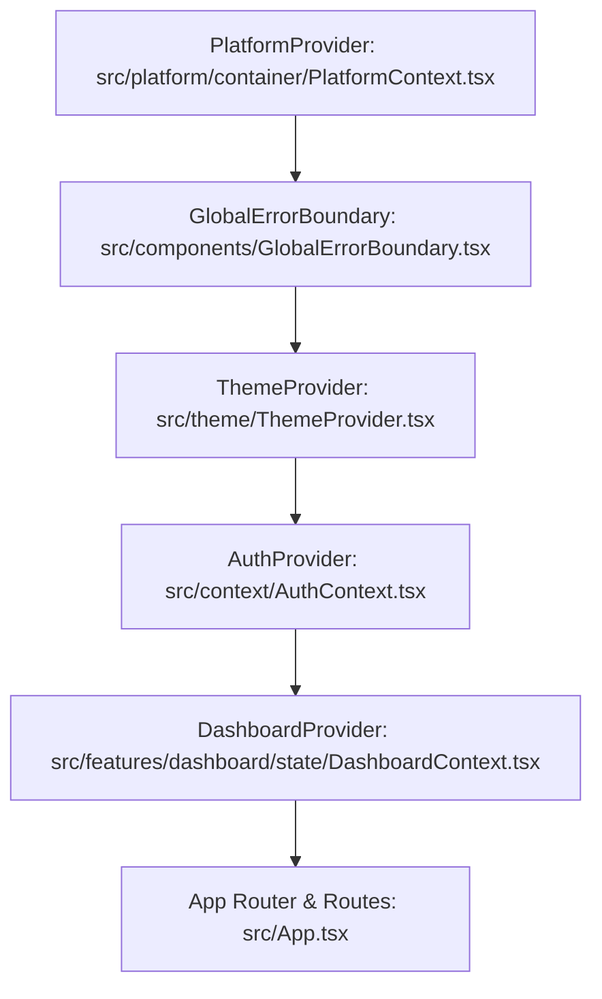
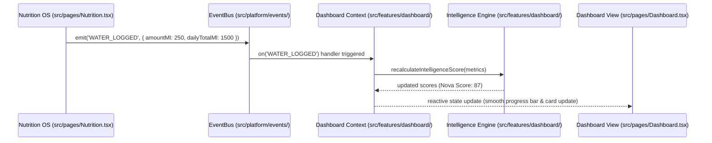

# FitNova AI — Platform Integration & Dashboard Reliability (Sprint 2.5)

## Overview

Sprint 2.5 establishes the live operational bridge between the **Platform Foundation Layer** (`src/platform/`) and the **FitNova SaaS Web Application**. It connects decoupled platform infrastructure (EventBus, Storage, Network, Telemetry, Analytics, Notifications, Error Handling) directly into application runtime, dashboard reactivity, network client, global error boundaries, and user feedback mechanisms.

---

## 1. Runtime Provider Hierarchy

The application entry point (`src/main.tsx`) bootstraps services in a strict, resilient order. If any downstream system fails, upper-level boundaries isolate and catch the fault without crashing the entire browser window.



### Hierarchy Responsibilities:
1. **`PlatformProvider`**: Instantiates and memoizes the root `PlatformContainer` once per application session. Supplies all 13 platform subsystems to React via typed hooks (`useEventBus`, `useStorage`, `useNotificationService`, `useApiClient`, `useAnalytics`, `useTelemetry`, `useFeatureFlags`).
2. **`GlobalErrorBoundary`**: Catches unhandled React render and lifecycle errors, normalizes them into structured `FitNovaError` instances, logs sanitized telemetry via `Logger`, and presents a styled, non-destructive recovery UI with a retry action.
3. **`ThemeProvider`**: Uses `StorageService` to persist theme preference (`dark` | `light`) under the `fitnova:ui_theme` key while retaining backward-compatible reading of legacy `fitnova-ui-theme`.
4. **`AuthProvider`**: Manages user authentication, token storage, and session lifecycle.
5. **`DashboardProvider`**: Subscribes to the platform `EventBus` to reactively update intelligence scores and dashboard metrics when user logs activity.

---

## 2. Centralized Network Client (`ApiClient`)

The platform provides a centralized, resilient `ApiClient` (`src/platform/network/ApiClient.ts`) built directly into the container and accessible via `useApiClient()` or `container.apiClient`.

### Key Capabilities:
- **Fast Offline Detection**: Before dispatching a network call, `ApiClient` queries `NetworkService.isOnline()`. If offline, it rejects immediately with a typed `NetworkError`, preventing pending network stalls and queue build-up.
- **Request Correlation**: Automatically generates and injects an `X-Correlation-ID` (`req_<timestamp>_<counter>`) into all outbound HTTP headers for end-to-end distributed tracing between client and backend logs.
- **Configurable Timeouts**: Utilizes native `AbortController` with a configurable timeout (default: 15,000ms), throwing a normalized `TimeoutError` if exceeded.
- **Automated Latency Telemetry**: Times every request with `performance.now()` and records metrics to `TelemetryService` (`recordLatency('API_LATENCY', ...)`), tracking endpoint latency and status codes.
- **Idempotency & Safe Retry Policy**:
  - Automatically retries transient 502, 503, 504, and 408 server errors with exponential backoff (100ms, 200ms, 400ms...).
  - **Strict Safety Rule**: Retries are ONLY executed on idempotent requests (`GET`, `HEAD`, `OPTIONS`). Mutation calls (`POST`, `PUT`, `DELETE`, `PATCH`) are never retried automatically to prevent duplicate transactions or state corruption.
- **Normalized Error Hierarchy**: Maps HTTP status codes into typed domain errors (`AuthenticationError`, `AuthorizationError`, `ValidationError`, `NetworkError`).

```typescript
// Example usage:
const apiClient = useApiClient();

try {
  const profile = await apiClient.get<UserProfile>('/users/profile');
} catch (err) {
  if (err instanceof AuthenticationError) {
    // Handle auth expiration
  }
}
```

---

## 3. Cross-Feature `EventBus` Reactivity

Features communicate in a completely decoupled manner through typed platform events. Features NEVER import other feature modules or states directly.



### Event Registry & Payloads:
- `WATER_LOGGED`: Triggered by water logs on Dashboard or Nutrition page (`amountMl`, `dailyTotalMl`).
- `MEAL_LOGGED`: Triggered when food is logged in diary (`mealId`, `mealType`, `calories`, `proteinGrams`, `carbsGrams`, `fatGrams`).
- `WORKOUT_COMPLETED`: Triggered upon finishing workout session (`workoutId`, `durationSeconds`, `totalVolume`, `totalSets`).
- `NETWORK_ONLINE` / `NETWORK_OFFLINE`: Emitted automatically as device connection status changes.

---

## 4. Storage Namespacing & Backward-Compatibility

All client storage operations go through `StorageService` (`src/platform/storage/StorageService.ts`).

- **Namespaced Partitioning**: Keys are prefixed with `fitnova:` by default (e.g. `fitnova:sidebar_collapsed`, `fitnova:ui_theme`).
- **Safe Isolation**: Calling `storage.clear()` removes only keys belonging to the `fitnova:` namespace, leaving third-party or root storage intact.
- **Fallback Compatibility**: Existing legacy unnamespaced keys (such as `fitnova-ui-theme`) are supported by reading through the storage adapter fallback before writing to new namespaced locations.

---

## 5. Offline Experience & Notification Feedback

The application includes non-intrusive UI feedback components mounted at the layout level (`src/components/Layout.tsx`):

1. **`OfflineIndicator` (`src/components/OfflineIndicator.tsx`)**:
   - Subscribes to `useNetworkStatus()`.
   - When offline, renders a subtle warning banner at the top of the viewport with a pulsating yellow indicator.
   - Non-blocking: allows users to browse cached data and navigate local views without modal obstruction.
2. **`NotificationToastContainer` (`src/components/NotificationToastContainer.tsx`)**:
   - Subscribes to `NotificationService`.
   - Renders animated Framer Motion toast alerts in the bottom-right viewport.
   - Categorizes toast variants by status (`success`, `info`, `warning`, `error`, `nutrition`, `workout`, `achievement`).
   - Supports auto-dismiss timers and manual close buttons.

---

## 6. Verification & Test Suite

The platform foundation and integration layers are continuously verified with Vitest:
- **14 Test Suites**
- **71 Passing Tests (0 Failures)**
- Zero TypeScript compiler errors (`tsc -b`)
- Clean production builds (`npm run build`)
