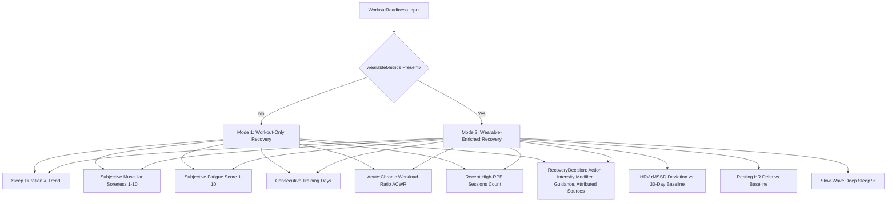

# FitNova AI — Recovery Intelligence & Wearable Analytics (Sprint 3.7)

## Overview

The **FitNova AI Recovery Intelligence Engine** (`src/features/workout/intelligence/` & `src/features/health/analytics/`) delivers a deterministic, multi-modal physiological recovery evaluation system. It bridges longitudinal workout fatigue metrics with real-time biometric telemetry (Heart Rate Variability, Resting Heart Rate, and Sleep Architecture) to dynamically modulate workout intensity, prescribe intelligent rest intervals, and guard against overtraining.

---

## 1. Dual-Mode Recovery Decision Architecture

The `RecoveryDecisionEngine` operates in two distinct, deterministic modes:



### Mode 1: Workout-Only Recovery
Used when wearable hardware is disconnected or unavailable. Evaluates:
- Self-reported sleep duration and multi-day sleep trend.
- Muscular soreness mapping across specific anatomical muscle groups.
- Systemic fatigue rating and consecutive training day accumulation.
- Acute:Chronic Workload Ratio (ACWR) and density of recent RPE $\ge 8.5$ sets.

### Mode 2: Wearable-Enriched Recovery
Activated automatically when biometric telemetry is present. In addition to workout history, evaluates:
- **Autonomic Nervous System Tone (HRV rMSSD)**: Detects parasympathetic activation vs sympathetic stress.
- **Cardiovascular Baselining (Resting Heart Rate Delta)**: Flags sustained cardiac strain.
- **Neuroendocrine Restoration (Deep Sleep Architecture)**: Assesses slow-wave sleep duration critical for growth hormone release and myofibrillar repair.

---

## 2. Mathematical Formulations & Weightings

### 1. Composite Daily Recovery Score (0–100)
The `RecoveryAnalytics` engine calculates a weighted composite physiological score:

$$\text{RecoveryScore} = 0.35 \times S_{\text{HRV}} + 0.35 \times S_{\text{Sleep}} + 0.20 \times S_{\text{RHR}} + 0.10 \times S_{\text{Activity}}$$

Where:
- **$S_{\text{HRV}}$**: Evaluates percentage deviation of morning rMSSD against rolling 30-day baseline.
  - $\text{Deviation} > +15\% \implies S_{\text{HRV}} = 95$ (Elevated / Primed)
  - $\text{Deviation} \in [-12\%, +15\%] \implies S_{\text{HRV}} = 85 + 1.5 \times \text{Deviation}$ (Optimal)
  - $\text{Deviation} < -12\% \implies S_{\text{HRV}} = \max(30, 70 + 1.5 \times \text{Deviation})$ (Suppressed)
- **$S_{\text{Sleep}}$**: Evaluates sleep duration, deep sleep percentage ($\ge 20\%$), and sleep efficiency ($\ge 85\%$).
  - Excellent ($>7.5\text{h}$, deep $\ge 20\%$, eff $\ge 88\%$) $\implies 95$
  - Good ($>6.5\text{h}$, eff $\ge 80\%$) $\implies 82$
  - Fair ($>5.0\text{h}$) $\implies 65$
  - Critical Deficit ($<5.0\text{h}$) $\implies 40$
- **$S_{\text{RHR}}$**: Evaluates deviation $\Delta\text{RHR} = \text{RHR}_{\text{current}} - \text{RHR}_{\text{baseline}}$.
  - $\Delta\text{RHR} \le -2 \implies 95$
  - $\Delta\text{RHR} \in [-1, +1] \implies 85$
  - $\Delta\text{RHR} \in [+2, +4] \implies 68$
  - $\Delta\text{RHR} > +4 \implies \max(30, 80 - 6 \times \Delta\text{RHR})$
- **$S_{\text{Activity}}$**: Evaluates prior-day active volume and non-exercise physical activity.

### 2. Readiness State Classification
| Recovery Score | Readiness State | Recommended Intensity | Intensity Modifier | Action |
|---|---|---|---|---|
| **80 – 100** | `optimal` | Full | 1.00 (100%) | `train_normal` |
| **65 – 79** | `moderate` | Moderate | 0.85 (85%) | `reduce_intensity` |
| **45 – 64** | `low` | Light | 0.65 (65%) | `reduce_intensity` / `recovery_workout` |
| **0 – 44** | `rest_recommended` | Active Recovery / None | 0.00 (0%) | `rest` |

---

## 3. Training Load Engine & Workload Ratios (ACWR)

The `TrainingLoadEngine` evaluates external training load balance:

### 1. Acute:Chronic Workload Ratio (ACWR)
$$\text{ACWR} = \frac{\text{Acute Load (Rolling 7-day Volume)}}{\max(1, \text{Chronic Load (Rolling 28-day Volume)} / 4)}$$

- **Optimal Sweet Spot ($\text{ACWR} \in [0.80, 1.30]$)**: Progressive overload is well-calibrated against recovery capacity.
- **Functional Overreaching ($\text{ACWR} \in [1.30, 1.50]$)**: Productive high-stimulus overload if followed by deload.
- **Excessive Spike ($\text{ACWR} > 1.50$)**: High injury and overtraining risk. Volume caps enforced.
- **Under-Training ($\text{ACWR} < 0.80$)**: Training stimulus below maintenance threshold.

### 2. Health-Enriched Training Strain & Recovery-Adjusted Load
- **Training Strain**:
  $$\text{TrainingStrain} = \text{Round}\left(\text{AcuteLoad} \times \max(0.5, \text{ACWR})\right)$$
- **Recovery-Adjusted Training Load**:
  $$\text{RecoveryAdjustedLoad} = \text{Round}\left(\text{AcuteLoad} \times \frac{\text{RecoveryScore}}{100}\right)$$
- **Under-Recovery Warning (`isUnderRecoveryWarning`)**:
  Triggered when $\text{RecoveryScore} < 60$, or HRV trend is `declining`, or $\text{ACWR} > 1.50$.

---

## 4. Nova Recovery Brief Contract

`NovaWorkoutService.getRecoveryBrief()` produces an actionable, transparent recovery summary:

```typescript
export interface NovaRecoveryBriefContract {
  readinessScore: number;
  readinessState: 'optimal' | 'moderate' | 'low' | 'rest_recommended';
  action: 'train_normal' | 'reduce_intensity' | 'recovery_workout' | 'rest';
  recommendedIntensity: 'full' | 'moderate' | 'light' | 'active_recovery' | 'none';
  intensityModifierPct: number;
  headline: string;
  explanation: string;
  contributingSignals: string[];
  recommendedProtocols: string[];
  dataSources: string[];
}
```

### Transparent Attribution:
Every recommendation includes explicit attribution of which data sources were utilized (`workout_history`, `hrv`, `resting_hr`, `sleep`, `activity`), ensuring lifters understand *why* Nova suggested an intensity reduction or rest day.

---

## 5. Non-Medical Fitness Guidance Disclaimer

> [!IMPORTANT]
> FitNova AI's recovery scores, ACWR calculations, and Nova coaching briefs are designed strictly for sports performance conditioning, fatigue management, and athletic progression. They do not constitute medical diagnosis, cardiovascular clinical monitoring, or sleep pathology treatment.
