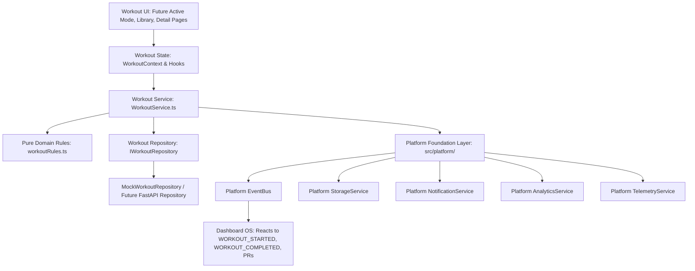
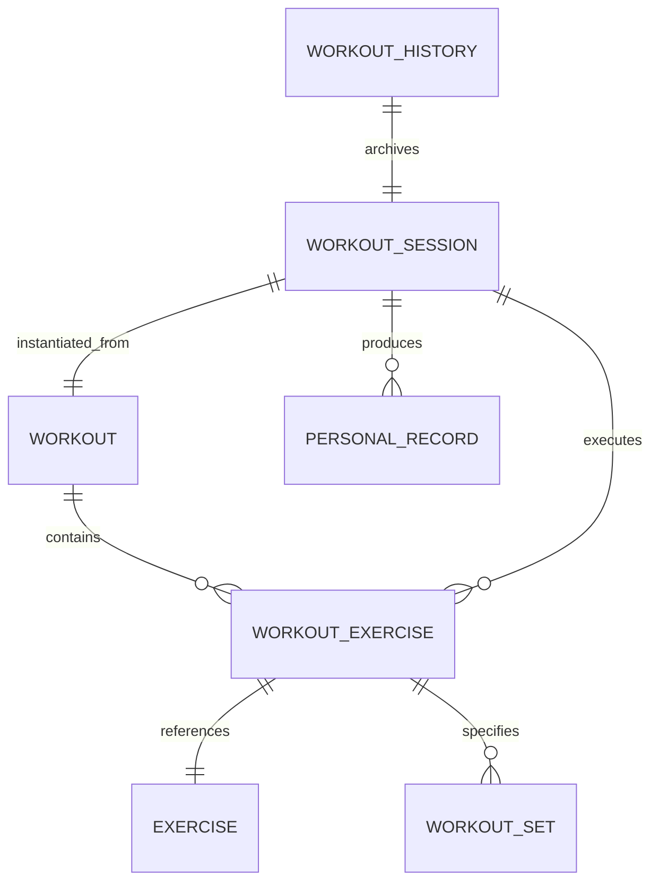
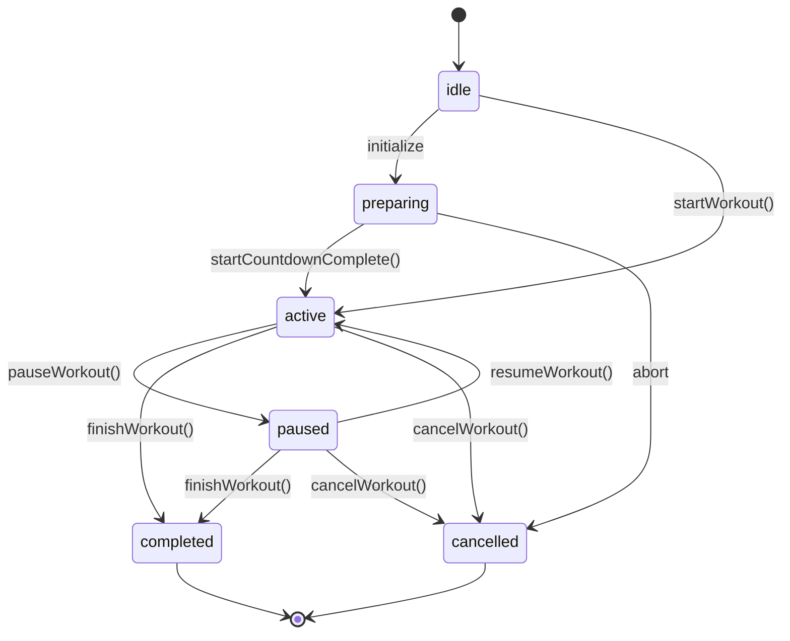
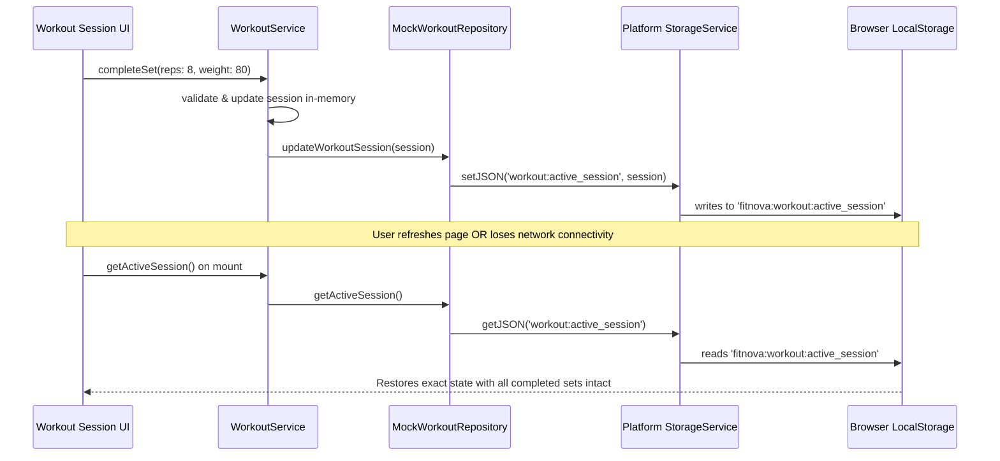

# FitNova AI — Workout OS Architecture (Sprint 3.1)

## Overview

The **Workout OS Foundation** (`src/features/workout/`) delivers a decoupled, production-grade domain, repository, service, state machine, and event architecture designed to power the current and future workout capabilities of FitNova AI (Workout Library, Workout Detail UX, Active Workout Mode, AI Progressive Overload, and Analytics).

---

## 1. Architectural Principles & Dependency Direction

The Workout OS strictly adheres to FitNova's unidirectional dependency architecture:



### Strict Non-Negotiable Rules:
- **UI → Feature → AI/Domain → Platform**: Domain models and calculation rules contain **zero React or UI dependencies**.
- **No Direct Coupling to Dashboard or Other Features**: Workout OS never imports Dashboard components or Nutrition views. Communication occurs exclusively via the platform `EventBus`.
- **Pluggable Repository Abstraction**: The service and state layers depend strictly on the `IWorkoutRepository` interface, allowing a seamless swap from `MockWorkoutRepository` to the FastAPI backend client in future sprints without changing any UI or business logic.

---

## 2. Directory Structure

```
src/features/workout/
├── models/                     # Strongly typed domain entities (Zero React dependencies)
│   ├── Exercise.ts             # Exercise entity, media, instructions, muscle targets
│   ├── Workout.ts              # Routine and template definition
│   ├── WorkoutExercise.ts      # Routine exercise with ordered sets and rest intervals
│   ├── WorkoutSet.ts           # Individual set model (reps, weight, RPE, status)
│   ├── WorkoutSession.ts       # Active live session model (status, elapsed, volumes)
│   ├── PersonalRecord.ts       # PR records (1RM, max weight, reps, volume)
│   ├── WorkoutHistory.ts       # Historical records of completed sessions
│   ├── WorkoutStats.ts         # Aggregated stats, volume trends, streaks
│   ├── Recommendation.ts       # WorkoutRecommendation contract for AI
│   └── index.ts                # Models barrel
├── types/                      # Enums, filter contracts, and parameter types
│   ├── enums.ts                # MuscleGroup, Equipment, WorkoutDifficulty, SessionStatus, SetType
│   ├── contracts.ts            # WorkoutFilter, ExerciseFilter, SessionParams
│   └── index.ts
├── constants/                  # Domain constraints and storage keys
│   ├── workoutConstants.ts     # Default rest periods, timeouts, storage keys
│   └── index.ts
├── utils/                      # Pure TypeScript business rules & math (Zero side effects)
│   ├── workoutRules.ts         # Volumes, completion %, 1RM (Epley), PR detection, stats
│   └── index.ts
├── mocks/                      # Realistic fitness dataset
│   ├── mockExercises.ts        # 21 realistic exercises across all muscle groups
│   ├── mockWorkouts.ts         # 8 comprehensive workout routines
│   ├── mockHistory.ts          # Past workout logs, personal records, and streaks
│   ├── mockRecommendations.ts  # Deterministic recommendations matching AI contract
│   └── index.ts
├── repositories/               # Data access abstraction layer
│   ├── IWorkoutRepository.ts   # Standard repository interface
│   ├── MockWorkoutRepository.ts# In-memory implementation with storage persistence
│   └── index.ts
├── events/                     # Typed platform EventBus dispatchers
│   ├── workoutEvents.ts        # Dispatchers for WORKOUT_STARTED, SET_COMPLETED, etc.
│   └── index.ts
├── services/                   # Feature-level business orchestration
│   ├── WorkoutService.ts       # Coordinates repos, state, events, storage, telemetry
│   └── index.ts
├── state/                      # Session state machine & React context
│   ├── WorkoutSessionState.ts  # Deterministic state machine transition rules
│   ├── WorkoutContext.tsx      # React context, rest timer, active session lifecycle
│   └── index.ts
├── hooks/                      # Ergonomic React hooks
│   ├── useWorkouts.ts          # Catalog query and filtering
│   ├── useWorkoutDetails.ts    # Single workout routine fetcher
│   ├── useWorkoutSession.ts    # Active session state & operations
│   ├── useWorkoutHistory.ts    # User workout history & diary
│   ├── usePersonalRecords.ts   # User PR tracking
│   └── index.ts
└── index.ts                    # Master public barrel
```

---

## 3. Domain Model Relationships



---

## 4. Live Session State Machine

The active workout session is governed by a deterministic finite state machine to eliminate invalid lifecycle transitions:



### Transition Guarantees:
- **Terminal States**: `completed` and `cancelled` are terminal; sessions cannot be resumed or modified once finished.
- **Single Active Session**: `WorkoutService.startWorkout()` verifies no other session is in `active` or `paused` state before starting.

---

## 5. Event Flow & Cross-Feature Reactivity

Workout OS dispatches typed events over the platform `EventBus` (`src/platform/events/EventBus.ts`):

| Event Name | Trigger Condition | Downstream Consumers & Behavior |
| :--- | :--- | :--- |
| `WORKOUT_STARTED` | User starts live session | **Dashboard OS**: Updates active state / readiness dial. **Analytics**: Logs session metadata. |
| `WORKOUT_PAUSED` | User pauses active workout | **Telemetry / Session Timer**: Freezes active duration counting. |
| `WORKOUT_RESUMED` | User resumes active workout | **Telemetry / Session Timer**: Restarts active duration, computes pause delta. |
| `SET_COMPLETED` | User completes an exercise set | **Analytics**: Tracks reps/weight. **Rest Timer**: Auto-starts rest countdown. |
| `EXERCISE_COMPLETED` | All sets in an exercise done | **UI**: Triggers celebratory indicator and advances active index. |
| `PERSONAL_RECORD_ACHIEVED` | New 1RM or max weight detected | **Notifications**: Sends achievement toast. **Dashboard**: Updates PR counter. |
| `WORKOUT_COMPLETED` | Session finished and logged | **Dashboard OS**: Triggers reactive re-fetch of streaks and volume dials. **Notification**: Dispatches celebration toast. |
| `WORKOUT_CANCELLED` | User aborts session | **Dashboard OS**: Clears active session display. |

---

## 6. Offline Support & State Survival



- **Zero Data Loss**: In-progress sets are saved to `StorageService` immediately on every completion.
- **Seamless Recovery**: If the user closes their browser or navigates away, returning to the app immediately restores the active workout session.

---

## 7. AI Integration Boundary

The Workout OS defines a deterministic integration boundary for future AI features (Progressive Overload, Workout Recommendations, Dynamic Deloads) without direct coupling to Gemini or API keys:

```typescript
export interface WorkoutRecommendation {
  workoutId: string;
  workoutName: string;
  score: number; // 0.0 to 1.0 match score
  reason: string;
  readinessAlignment: number; // 0.0 to 1.0
  durationAlignment: number; // 0.0 to 1.0
  goalAlignment: number; // 0.0 to 1.0
  recoveryAlignment: number; // 0.0 to 1.0
}
```

This contract is fully compatible with the existing `src/services/ai/services/RecommendationService.ts` and `WorkoutPlannerService.ts`.
