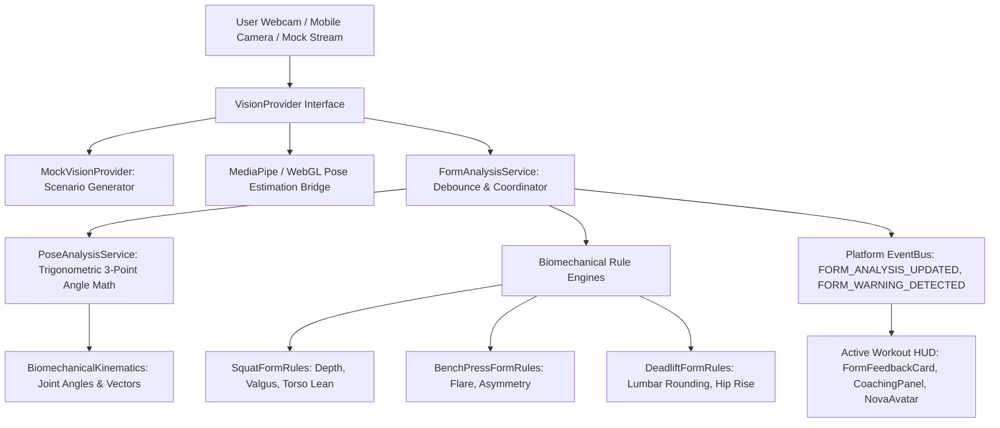

# FitNova AI — AI Form Analysis & Computer Vision Architecture (Sprint 3.7)

## Overview

The **FitNova AI Vision Foundation** (`src/features/workout/vision/`) provides real-time biomechanical movement analysis, joint angle kinematics, and automated exercise form assessment during live workouts. The system converts raw video pose landmarks into actionable, real-time audio-visual cues while maintaining complete user privacy through strictly ephemeral, on-device analysis.

---

## 1. Architectural Hierarchy & Data Flow

Vision processing follows FitNova AI's unidirectional architectural rule:



### Strict Non-Negotiable Architectural Rules:
- **Zero Framework / React Dependencies in Core Logic**: Landmark parsing, trigonometry, and biomechanical rules are pure TypeScript with zero UI dependencies.
- **Provider Interchangeability**: Live camera capture and synthetic testing scenarios adhere to the same `VisionProvider` interface.
- **Privacy-First (Zero Persistent Frame Storage)**: Video frames and landmark coordinates are analyzed in memory and immediately discarded. No video or imagery is ever persisted, cached, or transmitted to remote servers.
- **Strict Typing (Zero `any`)**: All landmarks, angles, form assessments, issues, and event payloads are strongly typed.

---

## 2. Directory Structure

```
src/features/workout/vision/
├── models/                     # Strongly typed kinematic domain models
│   ├── PoseLandmark.ts         # 3D normalized body landmarks (MediaPipe compatible)
│   ├── JointAngle.ts           # Calculated 3-point joint angles & kinematics
│   ├── FormAssessment.ts       # Form score (0-100), rating, issues, cues
│   └── index.ts
├── providers/                  # Camera & vision capture providers
│   ├── VisionProvider.ts       # Abstract interface defining standard capture contract
│   ├── MockVisionProvider.ts   # Scenario-driven kinematic simulator (optimal, faults)
│   └── index.ts
├── rules/                      # Biomechanical evaluation engines
│   ├── SquatFormRules.ts       # Depth, knee valgus collapse, torso inclination
│   ├── BenchPressFormRules.ts  # Shoulder flare, bilateral pressing asymmetry
│   ├── DeadliftFormRules.ts    # Spinal flexion, premature hip shooting
│   └── index.ts
├── services/                   # Application services
│   ├── PoseAnalysisService.ts  # Trigonometric 3-point angle & vector mathematics
│   ├── FormAnalysisService.ts  # Lifecycle coordinator, debouncer, EventBus publisher
│   └── index.ts
├── hooks/                      # React presentation hooks
│   ├── useFormAnalysis.ts      # Active live tracking hook for workout UI
│   └── index.ts
└── index.ts                    # Public barrel export
```

---

## 3. Trigonometric Angle Mathematics

The `PoseAnalysisService` evaluates geometric angles formed at joint vertices:

Given landmark $A (x_1, y_1)$, vertex joint $B (x_2, y_2)$, and distal landmark $C (x_3, y_3)$:

$$\theta = |\text{atan2}(y_3 - y_2, x_3 - x_2) - \text{atan2}(y_1 - y_2, x_1 - x_2)| \times \frac{180}{\pi}$$

If $\theta > 180^\circ$, then $\theta = 360^\circ - \theta$.

The calculated angle represents the inner articulation in degrees $[0^\circ, 180^\circ]$.

### Tracked Articulations:
- **Knee Flexion**: Hip $\rightarrow$ Knee $\rightarrow$ Ankle (Bilateral)
- **Hip Flexion**: Shoulder $\rightarrow$ Hip $\rightarrow$ Knee (Bilateral)
- **Elbow Flexion**: Shoulder $\rightarrow$ Elbow $\rightarrow$ Wrist (Bilateral)
- **Shoulder Abduction**: Hip $\rightarrow$ Shoulder $\rightarrow$ Elbow (Bilateral)
- **Torso Inclination**: Angle between shoulder midpoint-to-hip midpoint vector and the true vertical axis.
- **Knee Valgus Index**: Normalized horizontal displacement between knee width and ankle width:
  $$\text{ValgusIndex} = (\text{KneeWidth} - \text{AnkleWidth})$$
  Negative values indicate medial collapse (inward knee cave).

---

## 4. Biomechanical Rule Engines

### 1. Barbell Back Squat (`SquatFormRules`)
| Movement Fault | Kinematic Trigger | Severity | Corrective Cue |
|---|---|---|---|
| **Shallow Depth** | Knee flexion $> 105^\circ$ at inflection point | Moderate (-15 pts) | *"Descend until hip crease is level with or slightly below the top of your knees."* |
| **Knee Valgus** | Knee Valgus Index $< -0.05$ (severe: $< -0.12$) | High (-25 pts) | *"Track your knees outward in line with your 2nd and 3rd toes during the ascent."* |
| **Torso Collapse** | Torso inclination $> 45^\circ$ from vertical | Moderate (-15 pts) | *"Keep chest proud, pull the bar into your upper traps, and maintain intra-abdominal pressure."* |

### 2. Barbell Bench Press (`BenchPressFormRules`)
| Movement Fault | Kinematic Trigger | Severity | Corrective Cue |
|---|---|---|---|
| **Excessive Elbow Flare** | Shoulder abduction $> 80^\circ$ | High (-20 pts) | *"Tuck your elbows to roughly 45°–70° relative to your torso and engage your lats."* |
| **Pressing Asymmetry** | $\| \text{LeftElbow} - \text{RightElbow} \| > 15^\circ$ | Moderate (-15 pts) | *"Drive equally through both palms and press simultaneously off your chest."* |

### 3. Conventional Deadlift (`DeadliftFormRules`)
| Movement Fault | Kinematic Trigger | Severity | Corrective Cue |
|---|---|---|---|
| **Lumbar Rounding** | Torso lean $> 55^\circ$ with hip angle $< 75^\circ$ | High (-25 pts) | *"Brace your abdominal wall, pack your lats, and pull the slack out of the bar before lifting."* |
| **Premature Hip Rise** | Torso lean $> 65^\circ$ during initial pull phase | Moderate (-15 pts) | *"Push the floor away with your legs and keep your chest rising at the same rate as your hips."* |

---

## 5. Frame Throttling & Feedback Debouncing

- **Processing Rate**: Target 10–15 FPS on client hardware to prevent thermal throttling or CPU spikes on mobile devices.
- **Feedback Debounce (Default: 600ms)**: Auditory and visual corrective warnings are debounced to prevent sensory overload and allow the lifter time to implement the correction.
- **Top Warning Prioritization**: Only the single highest-severity issue is elevated as the primary corrective cue at any given moment.

---

## 6. Privacy & Safety Boundaries

> [!IMPORTANT]
> **Privacy Guarantee**: All computer vision inference and skeletal calculations occur strictly on-device in volatile client memory. No video streams, images, or pose frames are saved to local storage, transmitted over networks, or uploaded to servers.
>
> **Non-Medical Guidance**: Biomechanical cues are designed strictly for fitness conditioning and technique self-monitoring. They do not diagnose musculoskeletal pathology or replace physical therapists.
